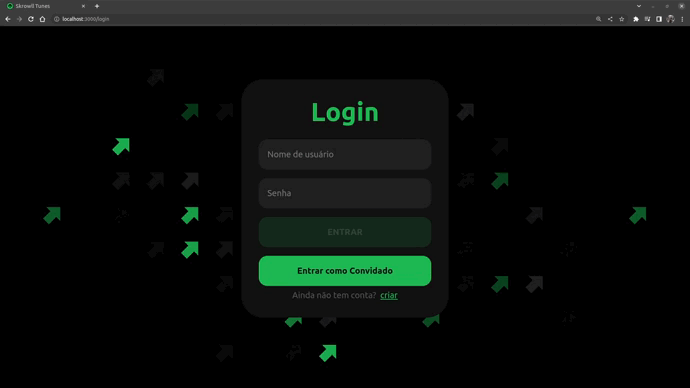
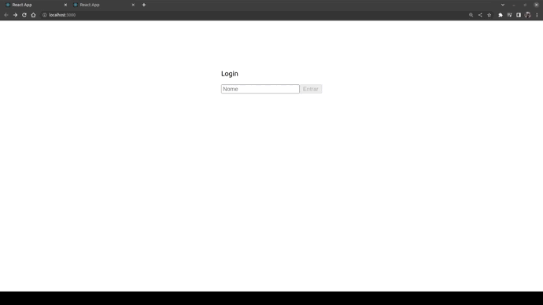

# SkrowllTunes 🎧
# Boas vindas ao repositório do projeto SkrowllTunes!
Este projeto consiste em uma aplicação criada para permitir que o usuário pesquise por álbuns musicais de um artista específico. Ao digitar o nome do artista na barra de pesquisa, o usuário verá uma lista de álbuns disponíveis e, ao clicar em um dos álbuns, poderá visualizar a lista de músicas correspondentes e favoritá-las. Além disso, cada música terá uma prévia de 30 segundos para que o usuário possa escutá-la.
Futuramente o usuário deverá ser capaz de conferir a lista das múiscas favoritas e também de alterar informações do seu perfil.
##### API utilizada: [iTunes](https://developer.apple.com/library/archive/documentation/AudioVideo/Conceptual/iTuneSearchAPI/index.html#//apple_ref/doc/uid/TP40017632-CH3-SW1)
##### Para o Login foi criado um CRUD de usuários utilizando uma API Restfull feita com Node.js, Express e Sequelize se conectando à um banco de dados PostgreSQL, seguindo a arquitetura de software MSC. [Repositório](https://github.com/skrowll/api-postgres-render)

# Sumário
- [Boas vindas ao repositório do projeto SkrowllTunes!](#boas-vindas-ao-repositório-do-projeto-skrowlltunes)
- [Sumário](#sumário)
- [Tecnologias utilizadas](#tecnologias-utilizadas)
- [Prévia](#prévia)
- [Versão anterior](#versão-anterior)
- [Rodando na sua máquina](#rodando-na-sua-máquina)
- [Pré-requisitos](#pré-requisitos)
- [Instalação](#instalação)
- [Autor](#autor)
# Tecnologias utilizadas


# Prévia

* Para acessar o site clique [Aqui](https://tunes.skrowll.online)
# Versão anterior

* Para acessar o repositório clique [Aqui](https://github.com/skrowll/trybe-project-trybetunes)
# Rodando na sua máquina
## Pré-requisitos
Antes de começar, você vai precisar ter instalado em sua máquina as seguintes ferramentas:
[Git](https://git-scm.com), [Node.js](https://nodejs.org/en/).
Além disto é bom ter um editor para trabalhar com o código como [VSCode](https://code.visualstudio.com/)
## Instalação
Clone esse repositório:
```
git clone https://github.com/skrowll/project-skrowlltunes.git
```
Entre na pasta do repositório que você acabou de clonar:
 ```
cd project-skrowlltunes
  ```
Instale as dependências:
 ```
npm install
  ```
Para rodar a aplicação:
  ```
npm start
  ```
### Autor:
<a href="mailto:lucasdejesus.rocha@hotmail.com" target="_blank"></a>
<a href="https://api.whatsapp.com/send?phone=5511964421447" target="_blank"></a>
<a href="https://www.linkedin.com/in/lucasjrocha/" target="_blank"></a>


